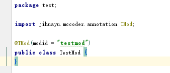
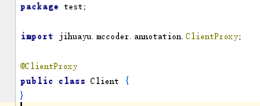
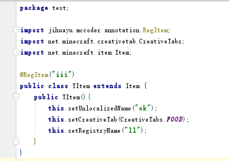
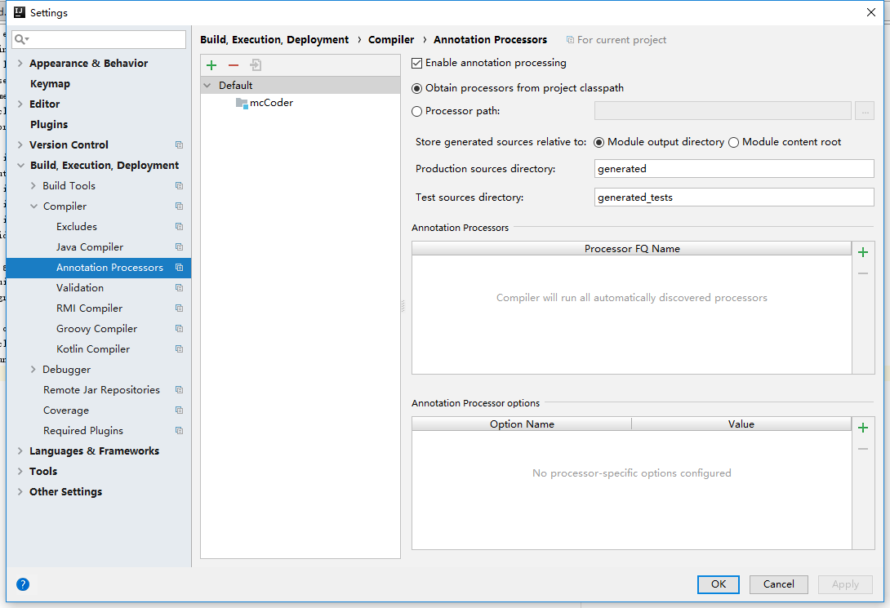

# McCoder项目指南

## 试玩McCoder

- 目前`McCoder`实现了3个半注解，下面我们将带大家体会使用`McCoder`创建一个mod并添加物品的过程。
- 为工程添加`McCoder`的依赖。
- 创建一个类`TestMod`作为主类，并为其打上`TMod`注解，如下图：  
  
- 创建一个`CommonProxy`作为服务端代理，并为其打上`CommonProxy`注解，如下图：  
  
- 创建一个`ClientProxy`作为客户端端代理，并为其打上`ClientProxy`注解，如下图：  

- 创建一个物品，并为其打上`RegItem`注解，如下图：  

- 打开游戏，发现mod已经成功加载，物品已经成功注册。

- 如果没有成功请检查IDE是否开启`annotation processing`，下图为IDEA的打开位置：  

- 如果还是失败请添加依赖`tools.jar`。该文件位于JDK 1.8目录的lib文件夹

- 如果编译失败或者没有达到效果，请进行重新全部编译(`Rebuild`)。

- 如果有其他问题可以给我发issues，或者加我的qq：8042833